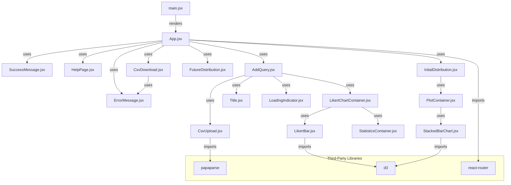
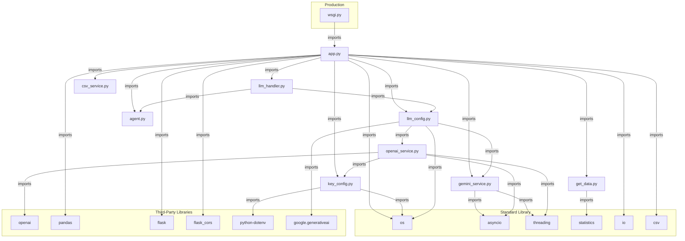
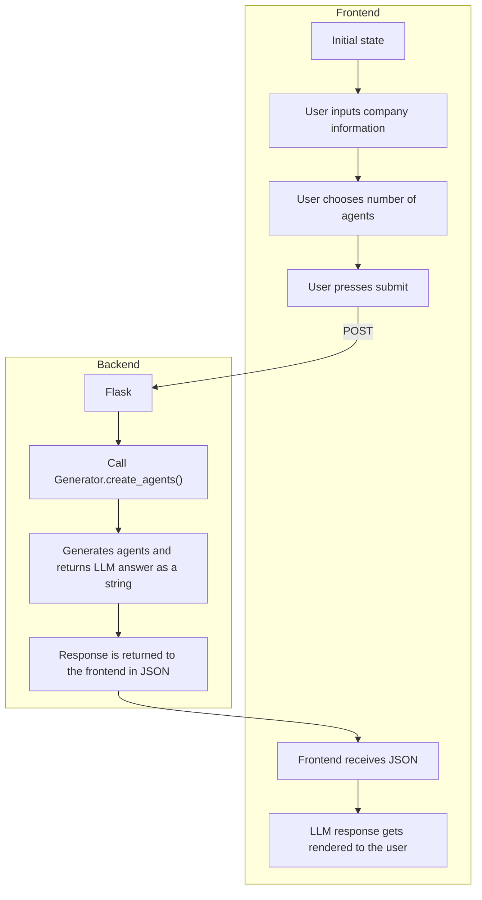

# Architecture

## Dependencies

### Frontend

> [!NOTE]
> All frontend components import React, this is not explicitly mentioned in the graph

```mermaid
graph TD
    App[App.jsx] -->|uses| ErrorMessage[ErrorMessage.jsx]
    App -->|uses| SuccessMessage[SuccessMessage.jsx]
    App -->|uses| HelpPage[HelpPage.jsx]
    App -->|uses| InitialDistribution[IntialDistribution.jsx]
    App -->|uses| AddQuery[AddQuery.jsx]
    App -->|uses| FutureDistribution[FutureDistribution.jsx]
    App -->|uses| CsvDownload[CsvDownload.jsx]

    InitialDistribution -->|uses| PlotContainer[PlotContainer.jsx]

    AddQuery -->|uses| Title[Title.jsx]
    AddQuery -->|uses| CsvUpload[CsvUpload.jsx]
    AddQuery -->|uses| LoadingIndicator[LoadingIndicator.jsx]
    AddQuery -->|uses| LikertChartContainer[LikertChartContainer.jsx]

    CsvDownload -->|uses| ErrorMessage

    LikertChartContainer -->|uses| LikertBar[LikertBar.jsx]
    LikertChartContainer -->|uses| StatisticsContainer[StatisticsContainer.jsx]

    PlotContainer -->|uses| StackedBarChart[StackedBarChart.jsx]

    main[main.jsx] -->|renders| App

    subgraph Third-Party Libraries
        papaparse
        d3
        react-router
    end

    CsvUpload -->|imports| papaparse
    LikertBar -->|imports| d3
    StackedBarChart -->|imports| d3
    App -->|imports| react-router

```

### Backend

```mermaid
graph TD
    app[app.py] -->|imports| key_config[key_config.py]
    app -->|imports| llm_config[llm_config.py]
    app -->|imports| agent[agent.py]
    app -->|imports| get_data[get_data.py]
    app -->|imports| gemini_service[gemini_service.py]
    app -->|imports| llm_handler[llm_handler.py]
    app -->|imports| csv_service[csv_service.py]

    llm_handler -->|imports| llm_config
    llm_handler -->|imports| agent

    openai_service[openai_service.py] -->|imports| key_config

    llm_config -->|imports| openai_service
    llm_config -->|imports| gemini_service

    subgraph Production
        wsgi[wsgi.py]
    end

    wsgi -->|imports| app

    subgraph Standard Library
        os
        asyncio
        threading
        statistics
        io
        csv
    end

    subgraph Third-Party Libraries
        openai
        pandas
        flask
        flask_cors
        python-dotenv
        google.generativeai
    end

    gemini_service -->|imports| asyncio
    gemini_service -->|imports| threading

    get_data -->|imports| statistics

    openai_service -->|imports| asyncio
    openai_service -->|imports| threading
    openai_service -->|imports| openai

    app -->|imports| os
    app -->|imports| io
    app -->|imports| csv
    app -->|imports| pandas
    app -->|imports| flask
    app -->|imports| flask_cors

    key_config -->|imports| os
    key_config -->|imports| python-dotenv

    llm_config -->|imports| os
    llm_config -->|imports| google.generativeai


```

## User input flowchart

```mermaid
graph TD
    subgraph Frontend
        initial[Initial state] --> company_info[User inputs company information]
        company_info --> agent_count[User chooses number of agents]
        agent_count --> submit[User presses submit]
        json[Frontend receives JSON] --> response_state[LLM response gets rendered to the user]
    end

    subgraph Backend
        submit -->|POST| server[Flask]
        server --> generator["Call Generator.create_agents()"]
        generator --> create_agents[Generates agents and returns LLM answer as a string]
        create_agents --> response[Response is returned to the frontend in JSON]
        response --> json
    end
```
